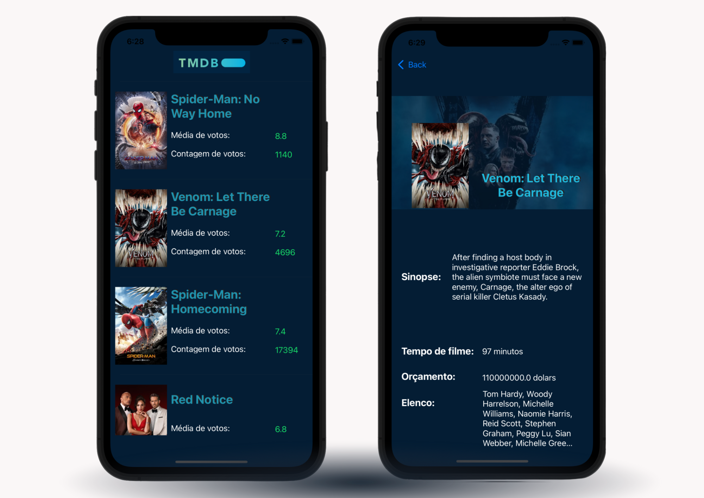

## ClickBus - Desafio iOS

### Objetivo

Criar um app que lista os filmes mais populares do momento, contendo filtros por gênero e uma tela mostrando os detalhes do filme selecionado.

### Teste - Michelli Cristina:

- Imagens importadas através de SDWebImage
- Cores inspiradas no Logotipo: TMDB

O app deve conter:
  * Uma lista dos filmes mais populares no momento.
  * Essa lista deve iniciar apresentando os 20 filmes da primeira página retornada pela API. Quando o usuário chegar ao final da lista, mais 20 filmes (próxima página da API) devem ser carregados e adicionados ao final da lista. E assim sucessivamente.
  * Cada item da lista deve conter uma foto do filme, o título, a média e a contagem de votos.
  * O item da lista deve levar para uma tela de detalhes do filme, com uma imagem de fundo, diretor, atores, informações de lançamento, tempo, orçamento, quanto foi arrecadado com bilheteria... 
  
O código deve ser feito todo em Swift.

### Obrigada <3
